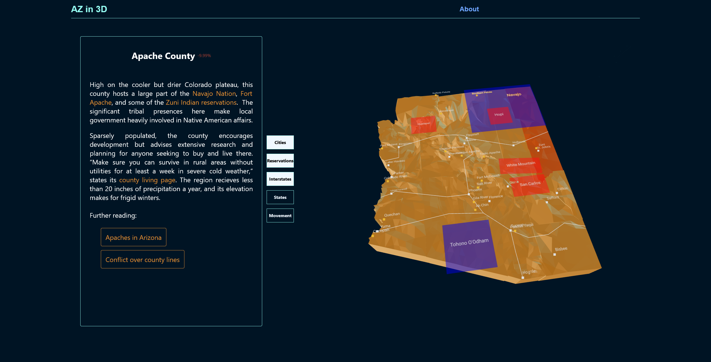

### AZ in 3D

This is an interactive informational for the state of Arizona, with 3D elements. To see the live site, you can [follow this link](https://soft-lamington-c3f329.netlify.app/). Made for mobile and desktop.

# Description

Blender was used to make 3D models. Three.js & react-three-fiber with @react-three/drei library were used to integrate and animate models. The result is a responsive, interactive 3D representation of Arizona where users can manipulate the scene by clicking on counties and toggling contextual overlays. It's just a learning project for 3D modeling and associated frontend development, particularly with react, three.js, and supporting libraries.

# Technology 

    React.js
    Blender
    three.js
    react-three-fiber
    @react-three/drei
    styled-components

# Installation

It's a live demo but can be run locally as a standard create-react-app project using npm start, npm test, and npm run build.

## Available Scripts
In project directory,can run:
`npm start`
`npm test`
`npm run build`
`npm run eject`
**Note: ejecting is a one-way operation. Once you `eject`, you can't go back!**

